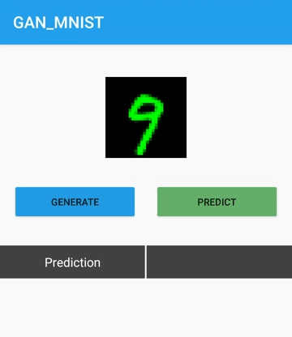

# GAN_MNIST
This is a demo app with two TfLite ML models:
1. A GAN model for generating handwritten digits
2. A classifier Model for classifying the digit generated by the GAN model

Feel free to git clone and run the app. 

For more details and explanations on the ML and android part, take at look at my article : 
https://hackernoon.com/from-tf-to-tflite-deploying-ml-models-on-mobile-part-1-8dl3uqg

